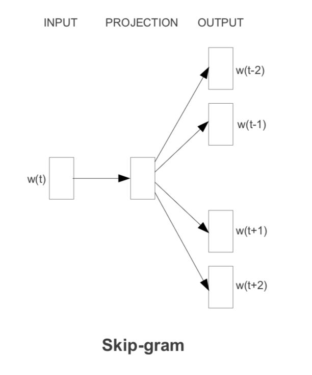

# N-gramas y modelos de lenguaje

En esta sección consideraremos el uso de n-gramas para
construir modelos de lenguaje. Los **modelos de lenguaje** son
una parte central de varias tareas de NLP (procesamiento de
lenguaje natural), como reconocimiento de lenguaje hablado, 
reconocimiento de lenguaje escrito, traducción automática, 
corrección de ortografía, sistemas de predicción de escritura,
etc. (ver [@jurafsky], capítulo 4).


## Ejemplo: Modelo de canal ruidoso.

Para entender más este problema consideramos el modelo del canal ruidoso:

```{block2, type='resumen'} 
**Canal ruidoso**
  
En el modelo del canal ruidoso tratamos mensajes recibidos como si fueran *distorsionados* o transformados al pasar por un canal de comunicación ruidoso (por ejemplo, escribir en el celular).

La tarea que queremos resolver con este modelo es 
inferir la palabra o texto correctos a partir de 

- Un modelo de distorsión o transformación (modelo del canal)
- Un modelo del lenguaje.
```

Ahora veremos por qué necesitamos estas dos partes. En notación de probabilidad, si observamos el mensaje transformado $X$ (texto con errores, sonido, página escrita), quisiéramos calcular, 
para cada mensaje **en texto** $W$ la probabilidad

$$P(W|X).$$

Propondríamos entonces como origen el texto $W^*$ que maximiza esta probabilidad condicional:

$$W^* = argmax_W P(W|X).$$

que en principio es un máximo sobre todas las posibles frases del lenguaje.

¿Cómo construimos esta probabilidad condicional? Tenemos que
para cada posible frase $W$,

$$P(W|X) = \frac{P(X|W)P(W)}{P(X)},$$

así que podemos escribir ($X$ es constante)

$$ W^* = argmax_W P(X|W)P(W).$$

Esta forma tiene dos partes importantes:

1. **Verosimilitud**: la probabilidad $P(X|W)$ de observar el mensaje transfromado $X$ dado que el mensaje es $W$. Este el el  **modelo del canal** (o **modelo de errores**), que nos dice cómo ocurren errores o transformaciones $X$ cuando se pretende comunicar el mensaje $W$.

2. **Inicial** o **previa**: La probabilidad $P(W)$ de observar el mensaje $W$ en el contexto actual. Esto depende más del lenguaje que del canal, y le llamamos el **modelo del lenguaje**.

3. Nótese que con estas dos partes tenemos un modelo generativo para mensajes del canal ruidoso: primero seleccionamos un texto mediante el modelo de lenguaje, con las probabilidades $P(W)$, y dado el mensaje
construimos el mensaje recibido según las probabilidades $P(X|W)$.

#### Ejemplos {-}

Supongamos que recibimos el mensaje $X=$"Estoy a días minutos". Esta
es una frase con baja probabilidad de ocurrir en español. 

Supongamos que tenemos sólo tres frases en nuestro lenguaje:

$W_1=$"Estoy a veinte minutos", $W_2=$"Estoy a diez minutos", y $W_3$= "No voy a llegar", y $W_4$="Estoy a tías minutos". Las probabilidades de cada una, dadas por el modelo de lenguaje, son
(independientemente del mensaje recibido):

```{r, echo=FALSE, warning=FALSE, message=FALSE}
library(tidyverse)
library(tidytext)
library(methods)
library(utils)
p <- data_frame(W = c("$W_1$","$W_2$", "$W_3$", "$W_4$"),
                `P(W)` = c(0.001, 0.001, 0.008, 0.000001)) 
p %>% knitr::kable(format = 'markdown')
```

Ahora supongamos que el modelo del canal nos da

```{r, echo=FALSE}
p <- data_frame(W = c("$W_1$","$W_2$", "$W_3$", "$W_4$"),
                `P(W)` = c(0.001, 0.001, 0.008, 0.000001),
                `P(X|W)` = c(0.01, 0.12, 0, 0.05)) 
p %>% knitr::kable(format = 'markdown')
```
Obsérvese que la probabilidad condicional más alta es la segunda, y en
este modelo es imposible que $W_3$ se transforme en $X$ bajo el canal ruidoso. Multiplicando estas dos probabilidades obtenemos:

```{r, echo=FALSE}
p <- data_frame(W = c("$W_1$","$W_2$", "$W_3$", "$W_4$"),
                `P(W)` = c(0.002, 0.001, 0.008, 1e-6),
                `P(X|W)` = c(0.01, 0.12, 0, 0.05)) %>%
  mutate(`P(X|W)P(W)` = `P(W)` * `P(X|W)`)
p %>% knitr::kable(format = 'markdown')
```
de modo que escogeríamos la segunda frase (máxima probabilidad condicional) como la interpretación de
"Estoy a días minutos".

Nótese que $P(X|W_3)$ en particular es muy bajo,
porque es poco posible que el canal distosione "No voy a llegar" 
a "Estoy a días minutos". Por otro lado $P(W_4)$ también
es muy bajo, pues la frase $W_4$ tiene probabilidad muy baja de 
ocurrir.

#### Ejercicio {-}

Piensa cómo sería el modelo de canal ruidoso $P(X|W)$ si nuestro problema fuera reconocimiento de frases habladas o escritas.

---

## Modelos de lenguaje: n-gramas

Más adelante podemos ver qué tipo de modelo del canal
podemos usar (por ejemplo, para errores de ortografía). Por
el momento, estudiaremos la construcción de las probabilidades
$P(W)$ (el modelo de lenguaje), donde $W$ es una sucesión de palabras.

Consideremos cómo construiríamos las probabilidades $P(W)$, de manera que
reflejen la ocurrencia de frases en nuestro lenguaje. Escribimos
$$W=w_1 w_2 w_3 \cdots w_n,$$ 
donde $w_i$ son las palabras que contienen el texto $W$.

Aquí nos enfrentamos al primer problema:

- Dada la variedad de frases que potencialmente hay en el lenguaje,
no tiene mucho sentido intentar estimar o enumerar
directamente estas probabilidades. Por ejemplo, si intentamos
algo como intentar ver una colección de ejemplos del lenguaje,
veremos que el número de frases es muy grande, y la mayor
parte de los textos o frases posibles en el lenguaje no
ocurren en nuestra colección (por más grande que sea la
colección).

Para tener un acercamiento razonable, necesitamos considerar
un modelo $P(W)$ con más estructura o supuestos. Hay varias maneras de hacer  esto, y un primer acercamiento
consiste en considerar solamente *el contexto más inmediato* de 
cada palabra. Es decir, la probabilidad de ocurrencia de palabras en una frase generalmente se puede evaluar con un contexto relativamente
chico (palabras cercanas) y no es necesario considerar la frase completa.

Consideramos entonces la regla del producto:

$$P(w_1 w_2 w_3 \cdots w_n) = P(w_1)P(w_2|w_1)P(w_3|w_1 w_2) \cdots
P(w_n|w_1 w_2 w_3 \cdots w_{n-1})$$
Y observamos entonces que basta con calcular las probabilidades
condicionales de la siguiente palabra:
$$P(w_{m+1}|w_1\cdots w_m)$$
para cualquier conjunto de palabras $w,w_1,\ldots, w_m$. 
A estas $w,w_1,\ldots, w_m$ palabras que ocurren justo antes de $w$ les
llamamos el *contexto* de $w$ en la frase. Por la regla
del producto, podemos ver entonces nuestro problema como uno
de **predecir la palabra siguiente**, dado el contexto. Por ejemplo,
si tenemos la frase "como tengo examen entonces voy a ....", la probabilidad
de observar "estudiar" o "dormir" debe ser más alta que la de "gato".

```{block2, type='resumen'}
- A una sucesión de longitud $n$ de palabras $w_1w_2\cdots w_n$ le
llamamos un **n-grama** de nuestro lenguaje.
```


Calcular todas estas condicionales contando tampoco es factible,
pues si el vocabulario es de tamaño $V$, entonces los contextos
posibles son de tamaño $V^m$, el cual es un número muy grande
incluso para $m$ no muy grande. Pero
podemos hacer una simplificación: suponer
que la predicción será suficientemente buena si limitamos el contexto de la siguiente
palabra. 

En el caso más simple, establecemos que la ocurrencia de una palabra es independiente de su contexto:

$$P(w_1|w_2\cdots w_{n-1}) = P(w_1)$$

de forma que el modelo del lenguaje se simplifica a:

$$P(w_1 w_2 w_3 \cdots w_n) = P(w_1)P(w_2)P(w_3) \cdots
P(w_n)$$

A este modelo le llamamos el modelo de **unigramas**.

Este modelo puede ser deficiente para algunas aplicaciones,
y las probabilidades calculadas con este modelo pueden estar muy
lejos ser razonables. Por ejemplo, el modelo de unigramas da la
misma probabilidad a la frase *un día* y a la frase *día un*, aunque
la ocurrencia en el lenguaje de estas dos frases es muy distinta.

Podríamos intentar un modelo usando **bigramas**, donde la siguiente
palabra sólo depende de palabra previa:

$$P(w_1\cdots w_n) = P(w_1)P(w_2|w_1)P(w_3|w_2)  P(w_4|w_3) \cdots P(w_n|w_{n-1}).$$

#### Ejemplo{-}
Supongamos que consideramos el modelo de bigramas,  y queremos calcular
la probabilidad de la frase "el perro corre". Entonces pondríamos
$$P(el,perro,corre) = P(el)P(perro \,|\, el)P(corre \,|\, perro)$$ 
Nótese que aún para frases más largas, sólo es necesario definir
$P(w|z)$ para cada para de palabras del vocabulario $w,z$, lo cual
es un simplificación considerable.


---

Y así podemos seguir . Por ejemplo, con el **modelo de trigramas**,

$$P(w_1\cdots w_n) = P(w_1)P(w_2|w_1)P(w_3|w_1w_2)  P(w_4|w_2w_3) \cdots P(w_n| w_{n-2} w_{n-1}).$$

**Observación**: los modelos de n-gramas son aproximaciones útiles, y fallan en la modelación de dependencias de larga distancia. Por ejemplo, en la frase "Tengo un gato en mi casa, y es de tipo persa" tendríamos que considerar n-gramas imprácticamente largos para modelar correctamente la ocurrencia de la palabra "persa" al final de la oración.


## Modelo de n-gramas usando conteos

Supongamos que tenemos una colección de textos o frases del lenguaje
que nos interesa.
¿Cómo podemos estimar las probabilidades del $P(w|a)$ $P(w|a,b)$?

El enfoque más simple es estimación por máxima verosimilitud, que 
en esto caso implica estimar con conteos de ocurrencia
en el lenguaje. Si queremos
estimar $P(w|z)$ (modelo de bigramas), entonces tomamos nuestra colección, y calculamos:

- $N(z,w)$ = número de veces que aparece $z$ seguida de $w$
- $N(z)$ = número de veces que aparece $z$.
- $P(w|z) = \frac{N(z,w)}{N(z)}$

Nótese que estas probabilidades en general son chicas (pues el
vocabulario es grande), de forma que conviene usar las log probabilidades
para hacer los cálculos y evitar *underflows*. Calculamos entonces usando:

- $\log{P(w|z)} = \log{N(zw)} - \log{N(z)}$

¿Cómo se estimarían las probabilidades para el modelo de unigramas
y trigramas?

#### Ejercicio {-}
Considera la colección de textos "un día muy soleado", 
"un día muy lluvioso", "un ejemplo muy simple de bigramas". Estima
las probabilidades $P(muy)$, $P(día | un)$, $P(simple | muy)$ usando
conteos.

## Corpus y vocabulario

En todos los ejemplos vistos arriba, vemos que necesitamos definir qué son
las *palabras* $w_i$, qué lenguaje estamos considerando, y cómo estimamos las probabilidades.

```{block2, type='comentario'}
- Un **corpus** es una colección de textos (o habla) del lenguaje que nos interesa.
- El **vocabulario** es una colección de palabras que ocurren en el **corpus** (o más general, en el lenguaje).
- La definición de **palabra** depende de la tarea de NLP que nos interesa.
```

Algunas decisiones que tenemos que tomar, por ejemplo:

- Generalmente, cada palabra está definida como una unidad separada
por espacios o signos de puntuación.
- Los signos de puntuación pueden o no considerarse como palabras.
- Pueden considerarse palabras distintas las que tienen mayúscula y las que no (por ejemplo, para reconocimiento de lenguaje hablado no nos
interesan las mayúsculas).
- Pueden considerarse palabras distintas las que están escritas incorrectamente, o no.
- Pueden considerarse plurales como palabras distintas, formas en masculino/femenino, etc. (por ejemplo, en clasificación de textos quizá
sólo nos importa saber la raíz en lugar de la forma completa de la palabra).
- Comienzos y terminación de oraciones pueden considerarse como
"palabras" (por ejemplo, en reconocimiento de texto hablado).

```{block2, type='resumen'}
Al proceso que encuentra todas las palabras en un texto se le
llama **tokenización** o **normalización de texto**. Los **tokens**
de un texto son las ocurrencias en el texto de las palabras
en el vocabuario.
```

En los ejemplos que veremos a continuación consideraremos las
siguiente normalización:

- Consideramos como una palabra el comienzo y el fin de una oración.
- Normalizamos el texto a minúsculas.
- No corregimos ortografía, y consideramos las palabras en la forma que ocurren.
- Consideramos signos de puntuación como palabras.

#### Ejemplo {-}
Por ejemplo, para el modelo de bigramas necesitamos poder
calcular $P(w|z)$ para cualquier par de palabras $w$ y $z$.
No necesitaremos calcular las probabilidades
$P(w)$ (una sola palabra), pues podemos como símbolo inicial
de cada frase un símbolo fijo como $\langle s \rangle$, y al final un símbolo
como $\langle /s \rangle$. Así, por ejemplo, $P(el|\langle s\rangle)$ es la probabilidad
de que la frase empiece on la palabra *el*. Entonces, para calcular
por ejemplo P(El perro corre), haríamos, bajo el modelo de bigramas

$$P(\langle s \rangle el\,perro\, corre \langle /s \rangle) = 
P(\langle s \rangle)P(el|\langle s \rangle)P(perro|el)P(corre|perro)P(corre|\langle /s \rangle)$$
Como $\langle s \rangle$ siempre ocurre la principio de las oraciones, $P(\langle s \rangle)=1$, de modo que

$$P(\langle s \rangle el\,perro\, corre \langle /s \rangle) = 
P(el|\langle s \rangle)P(perro|el)P(corre|perro)P(corre|\langle /s \rangle).$$

Nótese entonces que las probabilidades que queremos calcular
son todas de la forma $P(w|a).$

Para trigramas, por ejemplo, podemos agregar dos
símbolos de comienzo $\langle s \rangle\,\langle s \rangle$, y de
esta manera todas las probabilidades condicionales 
que buscamos calcular son de la forma $P(w|a,b)$


#### Ejemplo {-}

Comenzamos por limpiar nuestra colección de texto, creando también  *tokens* adicionales para signos de puntuación:

```{r}
normalizar <- function(texto, vocab = NULL){
  texto <- gsub("\\.\\s*$", "  _ss_", texto)
  texto <- tolower(texto)
  texto <- gsub("\\s+", " ", texto)
  texto <- gsub("\\.[^0-9]", " _ss_ _s_ ", texto)
  texto <- gsub("[«»]", "", texto) 
  texto <- gsub(";", " _punto_coma_ ", texto) 
  texto <- gsub("\\:", " _dos_puntos_ ", texto) 
  texto <- gsub("\\,[^0-9]", " _coma_ ", texto) 
  texto <- paste("_s_ _s_", texto)
  texto
}
restringir_vocab <- function(texto, vocab = vocab){
  texto_v <- strsplit(texto, " ")
  texto_v <- lapply(texto_v, function(x){
    en_vocab <- x %in% vocab
    x[!en_vocab] <- "_unk_"
    x
  })
  texto <- sapply(texto_v, function(x){
      paste(x, collapse = " ")
  })
  texto
}
corpus_mini <- c("Este es un ejemplo: el perro corre, el gato escapa. Este es un número 3.1416, otro número es 1,23.",
           "Este   es otro ejemplo.  " )
normalizar(corpus_mini)
```

Y ahora construimos, por ejemplo, los bigramas que ocurren en cada texto

```{r}
ejemplo <- data_frame(txt = corpus_mini) %>%
                mutate(id = row_number()) %>%
                mutate(txt = normalizar(txt)) 
bigrams_ejemplo <- ejemplo %>% 
                   unnest_tokens(bigramas, txt, token = "ngrams", 
                                 n = 2) %>%
                   group_by(bigramas) %>% tally()
knitr::kable(bigrams_ejemplo)
```


## Notas de periódico: modelo de n-gramas simples.

En los siguientes ejemplos, utilizaremos una colección de
noticias cortas en español (de España).


```{r, message = FALSE, warning = FALSE}
library(tidyverse)
periodico <- read_lines(file='../datos/noticias/ES_Newspapers.txt',
                        progress = FALSE)
length(periodico)
periodico[1:2]
```


```{r prepdf, cache = TRUE}
periodico_df <- data_frame(txt = periodico) %>%
                mutate(id = row_number()) %>%
                mutate(txt = normalizar(txt)) 
```                

Adicionalmente, seleccionamos una muestra para hacer las
demostraciones (puedes correrlo con todo el corpus):

```{r}
set.seed(123)
muestra_ind <- sample(1:nrow(periodico_df), 1e5)
periodico_m <- periodico_df[muestra_ind, ]
```

Y calculamos las frecuencias de todos los unigramas:

```{r unigramas, cache = TRUE}
conteo_ngramas <- function(corpus, n = 1, vocab = NULL){
  token_nom <- paste0('w_n_', rev(seq(1:n)) - 1)
  token_cond <- token_nom[-length(token_nom)]
  ngramas_df <- corpus %>% 
                unnest_tokens(ngrama, txt, token = "ngrams", n = n)
  frec_ngramas <- ngramas_df %>% group_by(ngrama) %>%
                  summarise(num = length(ngrama)) %>%
                  separate(ngrama, token_nom, sep=' ') %>%
                  group_by(!!!rlang::syms(token_cond)) %>%
                  mutate(denom = sum(num)) %>%
                  ungroup %>%
                  mutate(log_p = log(num) - log(denom))
  frec_ngramas
}
mod_uni <- conteo_ngramas(periodico_m, n = 1)
mod_bi  <- conteo_ngramas(periodico_m, n = 2)
mod_tri <- conteo_ngramas(periodico_m, n = 3)
```

```{r}
mod_uni %>% arrange(desc(num)) %>% head(100) %>% knitr::kable()
```


```{r}
mod_bi %>% arrange(desc(num)) %>% head(100) %>% knitr::kable()
```

¿Qué palabra es más probable que aparezca después de *en*,
la palabra *la* o la palabra *el*?

```{r}
mod_tri %>% arrange(desc(num)) %>% head(100) %>% knitr::kable()
```

### Cálculo de probabilidad de textos y suavizamiento simple

Podemos ahora evaluar la probabilidad de ocurrencia de 
textos utilizando las frecuencias que calculamos arriba:

```{r}
n_gramas <- list(unigramas = mod_uni,
                 bigramas  = mod_bi,
                 trigramas = mod_tri)

log_prob <- function(textos, n_gramas, n = 2, laplace = FALSE, delta = 0.001){
  df <- data_frame(id = 1:length(textos), txt = textos) %>%
         mutate(txt = normalizar(txt))
  token_nom <- paste0('w_n_', rev(seq(1:n)) - 1)
  df_tokens <- df %>% group_by(id) %>%
                unnest_tokens(ngrama, txt, 
                token = "ngrams", n = n) %>%
                separate(ngrama, token_nom, " ") %>%
                left_join(n_gramas[[n]], by = token_nom)
  if(laplace){
    V <- nrow(n_gramas[[1]])
    log_probs <- log(df_tokens[["num"]] + delta) - log(df_tokens[["denom"]] + delta*V )
    log_probs[is.na(log_probs)] <- log(1/V)
  } else {
    log_probs <- df_tokens[["log_p"]]
  }
  log_probs <- split(log_probs, df_tokens$id)
  sapply(log_probs, mean)
}
```

```{r}
textos <- c("Otro día muy soleado.",
            "Es este ejemplo un.",
           "Este es un ejemplo.",
           "Esta frase es normal.")
log_prob(textos, n_gramas, n = 1)
log_prob(textos, n_gramas, n = 2)
log_prob(textos, n_gramas, n = 3)
```


**Observaciones**:

- El modelo de unigramas claramente no captura estructura en el orden de palabras. Las primeras dos frases tienen probabilidad de ocurrir en 
el lenguaje muy distinta, pero este modelo les da la misma probabilidad.
- El modelo de bigramas da una probabilidad relativamente baja a la segunda frase, pero da 0 de probabilidad a la primera frase (existen bigramas no observados):
```{r}
n <- 2
textos <- "Otro día muy soleado."
df <- data_frame(id = 1:length(textos), txt = textos) %>%
         mutate(txt = normalizar(txt))
token_nom <- paste0('w_n_', rev(seq(1:n)) - 1)
df_tokens <- df %>% group_by(id) %>%
                unnest_tokens(ngrama, txt, 
                token = "ngrams", n = n) %>%
                separate(ngrama, token_nom, " ") %>%
                left_join(n_gramas[[n]], by = token_nom)
df_tokens
```
El problema es que no observamos "muy soleado".

- El modelo de trigramas, también da probabilidad 0 a la última frase, lo cual parece también parece incorrecto

---

Esta última observación es importante: cuando no encontramos en nuestros conteos
un bigrama (o trigrama, etc.) dado, la probabilidad asignada es 0. 

Aunque para algunas frases esta asignación es correcta (una texto que no puede
ocurrir en el lenguaje), muchas veces esto se debe a que los datos son ralos: la mayor
parte de la frases posibles no son observadas en nuestro corpus, y es erróneo
asignarles probabilidad 0. Más en general, cuando los conteos de bigramas son
chicos, sabemos que nuestra estimación por máxima verosimilitud tendrá varianza 
alta.

Estos ceros ocurren de dos maneras:

- Algunas palabras son *nuevas*: no las observamos en nuestros
datos de entrenamiento.
- No observamos bigramas, trigramas, etc. específicos (por ejemplo,
observamos *día*, y *aburrido* pero no observamos *día aburrido*).

Para el primero problema, podemos entrenar nuestro modelo
con una palabra adicional $<unk>$, que denotan palabras desconocidas.

Para el segundo problema, existen **técnicas de suavizamiento** (que veremos más adelante). El método más simple es el **suavizamiento de Laplace**,
en el que simplemente agregamos una cantidad $\delta$ a los conteos de unigramas, bigramas, etc.

Para unigramas, agregamos $\delta$ a cada posible unigrama. Si el tamaño del vocabulario
es $V$, y el conteo total de *tokens* es $N$, el nuevo conteo de *tokens* será entonces
$N+\delta V$, y la probabilidad para bigramas es:

$$P(w|a) = \frac{N(aw)}{N(a)} = \frac{N(aw)}{\sum_{z\in V} N(az)},$$
De modo que la estimación suavizada (sumando 1 a cada bigrama) es
$$P_{L}(w|a) = \frac{N(aw)+\delta}{\sum_{z\in V} N(az)+\delta}= \frac{N(aw) + \delta}{N(z)+ \delta V} = $$
Para trigramas,
$$P_{L}(w|ab) = \frac{N(abw)+\delta}{\sum_{z\in V} N(abz)+\delta}= \frac{N(abw) + \delta}{N(ab)+ \delta V} = $$
y así sucesivamente.

**Observación**: este método es útil para introducir la idea de
suavizamiento, pero existen otros mejores que veremos más adelante
(ver sección 4.5 de [@jurafsky]). Veremos más adelante también cómo
escoger hiperparámetros como $\delta$.

```{r}
textos <- c("Otro día muy soleado.",
            "Es este ejemplo un.",
           "Este es un ejemplo.",
           "Esta frase es normal.")
log_prob(textos, n_gramas, n = 1, laplace = TRUE)
log_prob(textos, n_gramas, n = 2, laplace = TRUE)
log_prob(textos, n_gramas, n = 3, laplace = TRUE)
```

Nótese que este suavizamiento cambia considerablemente las probabilides estimadas,
incluyendo algunas de ellas con conteos altos (esta técnica dispersa demasiada
probabilidad sobre conteos bajos).

---

### Palabras no vistas {-}

Otro problema adicional ocurre cuando encontramos palabras
que no habíamos observado con anterioridad. En este caso, 
la técnica de redistribuir probabilidad no funciona (pues
no sabemos cuántas palabras no vistas vamos a encontrar).

En lugar de eso, la idea es quitar algunas palabras
poco frecuentes en nuestro conjunto de datos y sustituir
por el token $<unk>$, que es un indicador de "palabra desconocida".
Si encontramos palabras desconocidas, utilizamos 
las probabilidades correspondientes de $<unk>$ para calcular
la probabilidad (ver más en [@jurafsky]).


## Evaluación de modelos

### Generación de texto

Una primera idea de qué tan bien funcionan estos modelos es generando
frases según las probabilidades que estimamos.

#### Ejemplo: unigramas {-}

Generamos algunas frases bajo el modelo de unigramas. Podemos construir
una frase comenzando con el token $<s>$, y paramos cuando encontramos
$</s>$. Cada token se escoge al azar según las probablidades $P(w)$.

```{r}
calc_siguiente_uni <- function(texto, n_gramas){
  u <- runif(1)
  unigramas_s <- arrange(n_gramas[[1]], log_p)
  prob_acum <- cumsum(exp(unigramas_s$log_p))
  palabra_no <- match(TRUE, u < prob_acum)
  as.character(unigramas_s[palabra_no, "w_n_0"])
}
texto <- "_s_"
fin <- FALSE
set.seed(12315)
while(!fin){
  siguiente <- calc_siguiente_uni(texto, n_gramas)
  texto <- c(texto, siguiente)
  if(siguiente == "_ss_"){
    fin <- TRUE
  }
}
paste(texto, collapse = " ")
```


#### Ejemplo: bigramas

```{r}
calc_siguiente_bi <- function(texto, n_gramas){
  u <- runif(1)
  n <- length(texto)
  anterior <- texto[n]
  siguiente_df <- filter(n_gramas[[2]], w_n_1 == anterior) %>% 
    arrange(log_p)
  palabra_no <- match(TRUE, u < cumsum(exp(siguiente_df$log_p)))
  as.character(siguiente_df[palabra_no, "w_n_0"])
}
texto <- "_s_"
set.seed(43)
for(i in 1:40){
  siguiente <- calc_siguiente_bi(texto, n_gramas)
  texto <- c(texto, siguiente)
  if(siguiente == "_ss_"){
    texto <- c(texto, "_s_")
  }
}
paste(texto, collapse = " ")
```


#### Ejemplo: trigramas

```{r}
calc_siguiente_tri <- function(texto, n_gramas){
  u <- runif(1)
  n <- length(texto)
  contexto <- texto[c(n,n-1)]
  siguiente_df <- filter(n_gramas[[3]], w_n_1 == contexto[1], w_n_2 == contexto[2]) %>% 
    arrange(log_p)
  palabra_no <- match(TRUE, u < cumsum(exp(siguiente_df$log_p)))
  as.character(siguiente_df[palabra_no, "w_n_0"])
}
texto <- c("_s_", "_s_")
set.seed(411)
for(i in 1:50){
  siguiente <- calc_siguiente_tri(texto, n_gramas)
  texto <- c(texto, siguiente)
  if(siguiente == "_ss_"){
    texto <- c(texto, "_s_")
  }
}
paste(texto, collapse = " ")
```

**Observación**: en este ejemplo vemos cómo los textos parecen más textos reales
cuando usamos n-gramas más largos. 

### Evaluación de modelos: perplejidad

 En general,
la mejor manera de hacer la evaluación de un modelo de lenguaje es en el contexto
de su aplicación (es decir, el desempeño en la tarea final para el que construimos
nuestro modelo): por ejemplo, si se trata de corrección de ortografía, qué tan bien
se desempeña el corrector de ortografía.

Sin embargo también podemos hacer una evaluación intrínseca del modelo considerando
muestras de entrenamiento y prueba. Una medida usual en este contexto
es la **perplejidad**.

```{block2, type='resumen'}
Sea $P(W)$ un modelo del lenguaje. Supongamos que observamos
un texto $W=w_1 w_2\cdots w_N$ (una cadena larga, que puede incluír varios separadores
$</s>, <s>$). La **log-perplejidad** del modelo sobre este texto es igual a
$$LP(W) = -\frac{1}{N} \log P(w_1 w_2 \cdots w_N),$$
  que también puede escribirse como
$$LP(W) = -\frac{1}{N} \sum_{i=1}^N \log P(w_i|w_1 w_2 \cdots w_{i-1})$$
La perplejidad es igual a
$$PP(W) = e^{LP(W)},$$ 
que es la medida más frecuentemente reportada en modelos de lenguaje.
```

**Observaciones**: 

- La log perplejidad es similar a la devianza (negativo de log-verosimilitud)
de los datos (palabras) observadas $W$ bajo el modelo $P$.
- Cuanto más grande es $P(W)$ bajo el modelo, menor es la perplejidad.
- Mejores modelos tienen valores más bajos de perplejidad. Buscamos
modelos que asignen muy baja probabilidad a frases que no son 
gramáticas, o no tienen sentido, y alta probabilidad a frases
que ocurren con frecuencia.

Bajo el modelo de bigramas, por ejemplo, tenemos que

$$LP(W) = -\frac{1}{N} \sum_{i=1}^N \log P(w_i|w_{i-1})$$

Y para el modelo de trigramas:
$$LP(W) = -\frac{1}{N} \sum_{i=1}^N \log P(w_i|w_{i-2}w_{i-1})$$

```{block2, type='resumen'}
- La evaluación de modelos la hacemos calculando la perplejidad en una
muestra de textos de prueba, que no fueron utilizados para
entrenar los modelos.
- Para palabras no vistas, entrenamos nuestros modelos sustituyendo
palabras no frecuentes con $<unk>$, y a las palabras no vistas
les asignamos el token $<unk>$.
```

---

#### Ejemplo {-}

Podemos usar nuestra función anterior para calcular la perplejidad. Para
los datos de entrenamiento vemos que la perplejidad es mejor para
los modelos más complejos:

```{r}
periodico_entrena <- periodico[muestra_ind]
textos <- periodico_entrena[1:1000]
texto_entrena <- paste(textos, collapse = " ")
exp(-log_prob(texto_entrena, n_gramas, n = 1, laplace = T))
exp(-log_prob(texto_entrena, n_gramas, n = 2, laplace = T))
exp(-log_prob(texto_entrena, n_gramas, n = 3, laplace = T))
```

Y para la muestra de prueba:


```{r}
periodico_prueba <- periodico[-muestra_ind]
textos <- periodico_prueba[1:1000]
texto_prueba <- paste(textos, collapse = " ")
exp(-log_prob(texto_prueba, n_gramas, n = 1, laplace = T))
exp(-log_prob(texto_prueba, n_gramas, n = 2, laplace = T))
exp(-log_prob(texto_prueba, n_gramas, n = 3, laplace = T))
```

Y vemos para este ejemplo que el mejor desempeño está dado por el modelo de bigramas, aunque no hemos hecho ningún ajuste ad-hoc del parámetro $\delta$. Como explicamos arriba,
es preferible usar otros algoritmos de suavizamiento.

**Observación**: En este caso, suavizamos las probabilidades de unigramas también, pero esto no es totalmente correcto. Para hacer la evaluación correctamente, es necesario usar los tokens $<unk>$ como
explicamos arriba.


####  Ejercicio {-}
Discute por qué: 

- El modelo de bigramas se desempeña mejor que el de unigramas
en la muestra de prueba.
- Parece que el modelo de trigramas, con 
nuestra colección de textos chicos, parece "sobreajustar", y tener
mal desempeño sobre la muestra de prueba. 


## Suavizamiento de conteos: otros métodos

Como discutimos arriba, el primer problema para generalizar
a frases o textos que no hemos visto, es que muchas veces no
observamos en nuestros datos de entrenamiento 
ciertos n-gramas con probabiliidad relativamente alta. Arriba
propusimos el suavizamiento de Laplace, que es una manera
burda de evitar los ceros y se basa en la idea de quitar
un poco de probabilidad a los n-gramas observados y redistribuir
sobre los no observados.

Podemos considerar métodos mejores observando que cuando
el contexto es muy grande (por ejemplo, trigramas), es fácil
no encontrar 0's en frases usuales del lenguaje (por ejemplo,
encontramos "Una geometría euclideana", "Una geometría no-euclideana",
pero nunca observamos Una geometría hiperbólica"). En este
caso, podríamos usar los *bigramas*, y considerar solamente
el bigrama "geometría hiperbólica", que quizá tiene algunas
ocurrencias en la muestra de entrenamiento. A este proceso se 
le llama **backoff**.

Un método popular con mejor desempeño que Laplace es
el **Kneser-Kney**. Consideremos el caso de bigramas.

En primer lugar, este método utiliza interpolación con
un modelo para bigramas:

$$P_{da}(w|a) = \frac{N(aw) - d}{N(a)} + \lambda(a) P(w).$$

Así que reducimos los conteos observados por una fracción
$d$, e interpolamos con las probabilidad de ocurrencia de unigramas. $\lambda(a)$ es tal que la suma de todas las probabilidades es igual a 1: $\sum_w P(w|a) = 1$.

En segundo lugar, en vez de usar las probabilidades crudas
de unigramas $P(w)$, usamos las probabilidades de continuación
de unigramas $P_{cont}(w)$:

$$P_{cont}(w) = \frac{\sum_{z\in V} N(zw)}
{ \sum_{z, b\in V} N(zb)}.$$

Que simplemente es la probabilidad de que $w$ sea una continuación después de alguna palabra (en el denominador están todas las posibles continuaciones sobre todas las palabras). Verifica que $\sum_{w\in V} P_{cont} (w) = 1$, de forma que es una distribución de probabilidad
sobre los unigramas.

La idea de este método se basa en la siguiente observación: 

- Hay palabras, como *embargo* que principalmente ocurren como continuación
de otras (**sin embargo**). 
- *embargo* puede tener probabilidad de unigrama alto porque *sin embargo* ocurre frecuentemente.
- En una frase como "Este es un día ...", quizá *aburrido* ocurre menos que *embargo*, pero *aburrido* es una continuación más apropiada.
- Si usamos las probabilidad de continuación, veríamos que 
$P_{cont}(embargo)$ es baja, pero $P_{cont}(aburrido)$ es más alta,
pues *aburrido* ocurre más como continuación.

Usaríamos entonces:

$$P_{da}(w|a) = \frac{N(aw) - d}{N(a)} + \lambda(a) P_{cont}(w).$$


### Desempeño {-}

Cuando construimos modelos grandes, una búsqueda directa en
una base de datos usual de n-gramas puede ser lenta (por ejemplo,
considera cómo funcionaría el *auto-complete* o la corrección de ortografía).

Hay varias alternativas. Se pueden filtrar los n-gramas menos frecuentes (usando las ideas de arriba para hacer backoff o interpolación con unigramas), y utilizar estructuras
apropiadas para encontrar los n-gramas. Otra solución es utilizar algoritmos más simples como
**stupid backoff** (que se usa para colecciones muy grandes de texto),
que consiste en usar la probabilidad del (n-1)-grama multiplicado
por una constante fija $\lambda$ si no encontramos el n-grama
que buscamos (Ver [@jurafsky]).

Finalmente, una opción es utilizar **filtros de bloom** para
obtener aproximaciones de los conteos. Si la frecuencia
de un n-grama $w$ es $f$, por ejemplo, insertamos en 
el filtro el elemento $(w, 2^j)$ para toda $j$ tal que
$2^j < f$. Para estimar un conteo de un n-grama observado,
simplemente checamos sucesivamente si el elemento $(w, 2^j)$ está
en el filtro o no, hasta que encontramos una $k$ tal que
$(w, 2^{k+1})$ no está en el filtro. Nuestra estimación
de la frecuencia del n-grama $w$ es entonces $2^k \leq f < 2^{k+1}$


## Representación de palabras y word2vec

Hay otras maneras de construir modelos de lenguaje que incluyen más estructura. El método de conteo/suavizamiento de ngramas es simple y funciona bien para algunas tareas, pero quizá podemos construir mejores modelos con enfoques más estructurados. 

Un enfoque que recientemente se ha vuelto más importante es el de redes neuronales. Si $w=w_1w_2\cdots w_N$ es una frase, y las $w$ representan palabras, recordemos que un modelo de lenguaje con dependencia de $n$-gramas consiste de las probabilidades

$$P(w_t | w_{t-1} w_{t-2} \cdots w_{t-n+1}),$$

 (n=2, bigramas, n=3 trigramas, etc.)

Y vimos que tenemos problemas cuando observamos sucesiones que no vimos en el corpus de entrenamiento. Este problema se puede "parchar" utilizando técnicas de suavizamiento. Aún para colecciones de entrenamiento muy grandes tenemos que lidiar con este problema.

Podemos tomar un enfoque más estructurado pensando en representaciones "distribucionales" de palabras:

1. Asociamos a cada palabra en el vocabulario un vector numérico con $d$ dimensiones, que es su *representación distribuida*.
2. Expresamos la función de probabilidad como combinaciones de 
las representaciones vectoriales del primer paso.
3. Aprendemos (máxima verosimiltud/con o sin regularización) simultáneamente los vectores y la manera de combinar 
estos vectores para producir probabilidades.

 La idea de este modelo es entonces subsanar la relativa escasez de datos (comparado con todos los trigramas que pueden existir) con estructura. Sabemos que esta es una buena estrategia si la estrucutura impuesta es apropiada.

```{block2, type='resumen'}
Una de las ideas fundamentales de este enfoque es representar
a cada palabra como un vector numérico de dimensión $d$. Esto
se llama una *representación vectorial distribuida*, o también
un *embedding de palabras*.
```


### Ejemplo {#ejemplo}
¿Cómo puede funcionar este enfoque? Por ejemplo, si vemos la frase "El gato corre en el jardín", sabemos que una frase probable debe ser también "El perro corre en el jardín", pero quizá nunca vimos en el corpus la sucesión "El perro corre". La idea es que como "perro" y "gato" son funcionalmente similares (aparecen en contextos similares en otros tipos de oraciones como el perro come, el gato come, el perro duerme, este es mi gato, etc.), un modelo como el de arriba daría vectores similares a "perro" y "gato", pues aparecen en contextos similares. Entonces el modelo daría una probabilidad alta a "El perro corre en el jardín".


## Modelo de red neuronal

Podemos entonces construir una red neuronal con 2 capas ocultas como sigue. Usemos el ejemplo de trigramas:

1. En la primera capa oculta, tenemos un mapeo de las entradas $w_1,\ldots, w_{n-1}$ a $x=C(w_1),\ldots, C(w_{n-1})$, donde $C$ es una función que mapea palabras a vectores de dimensión $d$. $C$ también se puede pensar como una matriz de dimensión $|V|$ por $d$. En la capa de entrada,

$$w_{n-2},w_{n-1} \to x = (C(w_{n-2}), C(w_{n-1})).$$


2. En la siguiente capa oculta tenemos una matriz de pesos $H$ y la función logística (o tangente hiperbólica) $\sigma$, como en una red neuronal usual. En esta capa calculamos
$$z = \sigma (a + Hx),$$
que resulta en un vector de tamaño $h$. 

3. Finalmente, la capa de salida debe ser un vector de probabilidades
sobre todo el vocabulario $|V|$. En esta capa tenemos pesos $U$ y hacemos
$$y = b + U\sigma (z),$$
y finalmente usamos softmax para tener probabilidades que suman uno:
$$p_i = \frac{\exp (y_i) }{\sum_j exp(y_j)}.$$

En el ajuste maximizamos la verosimilitud:

$$\sum_t \log \hat{P}(w_{t,n}|w_{t,n-2}w_{t-n-1}) $$ 


La representación en la referencia [@bengio] es:


Esta idea original ha sido explotada con éxito, aunque sigue siendo
muy intensivo en cómputo ajustar un modelo como este. Nótese que
el número de parámetros es del orden de $|V|(nm+h)$, donde $|V|$ es el tamaño del vocabulario (decenas o cientos de miles), $n$ es 3 o 4 (trigramas, 4-gramas), $m$ es el tamaño de la representacion (cientos) y $h$ es el número de nodos en la segunda capa (también cientos o miles).  Esto resulta en el mejor de los casos en modelos con miles de millones de parámetros. Adicionalmente, hay algunos cálculos costosos, como el softmax (donde hay que hacer una suma sobre el vocabulario completo). En el paper original se propone **descenso estocástico**.


## Representación de palabras

Un aspecto interesante de el modelo de arriba es que
nos da una representación vectorial de las palabras, en la forma
de los parámetros ajustados de la matriz $C$. Esta se puede entender
como una descripción numérica de cómo funciona una palabra en el contexto de su n-grama.

Por ejemplo, deberíamos encontrar que palabras como "perro" y "gato" tienen representaciones similares. La razón es que cuando aparecen,
las probabilidades sobre las palabras siguientes deberían ser similares, pues estas son dos palabras que se pueden usar en muchos contextos
compartidos.

También podríamos encontrar que palabras como perro, gato, águila, león, etc. tienen partes o entradas similares en sus vectores de representación, que es la parte que hace que funcionen como "animal mamífero" dentro de frases. 

Veremos que hay más razones por las que es interesante esta representación.


## Modelos de word2vec

Si lo que principalmente nos interesa es obtener la representación
vectorial de palabras, recientemente se descubrió que es posible 
simplificar considerablemente el modelo de arriba para poder entrenarlo mucho más rápido, y obtener una representación que en muchas tareas se desempeña bien ([@word2vec]).

Hay dos ideas básicas para reducir la complejidad del entrenamiento:

- Eliminar la segunda capa oculta: modelo de *bag-of-words* continuo y modelo de *skip-gram*.
- Cambiar la función objetivo (minimizar devianza/maximizar verosimilitud) por una más simple, mediante un truco que se llama *negative sampling*.

Como ya no es de interés central predecir la siguiente palabra a partir
de las anteriores, en estos modelos **intentamos predecir la palabra
central a partir de las que están alrededor**

### Arquitectura continuous bag-of-words

La entrada es igual que en el modelo completo. En primer lugar,
simplificamos la segunda capa oculta pondiendo en $z$ el promedio de
los vectores $C(w_{n-2}), C(w_{n-1})$.  La última capa la dejamos igual por el momento:


El modelo se llama bag-of-words porque todas las entradas de la primera capa oculta contribuyen de la misma manera en la salida, independientemente del orden. Aunque esto no suena como buena idea para construir un modelo de lenguaje, veremos que resulta en una representación adecuada para algunos problemas.


1. En la primera capa oculta, tenemos un mapeo de las entradas $w_1,\ldots, w_{n-1}$ a $x=C(w_1),\ldots, C(w_{n-1})$, donde $C$ es una función que mapea palabras a vectores de dimensión $d$. $C$ también se puede pensar como una matriz de dimensión $|V|$ por $d$. En la capa de entrada,

$$w_{n-2},w_{n-1} \to x = (C(w_{n-2}), C(w_{n-1})).$$


2. En la siguiente "capa"" oculta simplemente sumamos las entradas de $x$. Aquí nótese que realmente no hay parámetros.

3. Finalmente, la capa de salida debe ser un vector de probabilidades
sobre todo el vocabulario $|V|$. En esta capa tenemos pesos $U$ y hacemos
$$y = b + U\sigma (z),$$
y finalmente usamos softmax para tener probabilidades que suman uno:
$$p_i = \frac{\exp (y_i) }{\sum_j exp(y_j)}.$$

En el ajuste maximizamos la verosimilitud:

$$\sum_t \log \hat{P}(w_{t,n}|w_{t,n+1} \cdots w_{t-n-1})$$

### Arquitectura skip-grams

Otro modelo simplificado, con más complejidad computacional pero
mejores resultados (ver [@word2vec]) que
el bag-of-words, es el modelo de skip-grams. En este caso, dada
cada palabra que encontramos, intentamos predecir un número
fijo de las palabras anteriores y palabras posteriores 
(el contexto es una vecindad de la palabra).




Todavía se propone una simplificación adicional:

### Muestreo negativo

La siguiente simplificación consiste en cambiar la función objetivo. En word2vec puede usarse "muestreo negativo".

Para empezar, la función objetivo original (para un solo trigrama) es


$$E` = -\log \hat{P}(w_n|w_{n-1}w_{n+1}) = -y_w + \log\sum_j \exp(y_j).$$

La dificultad está en el segundo término, que es sobre todo el vocabulario en incluye todos los parámetros del modelo.


La idea del muestreo negativo es que si observamos
$w_n$ entre de $w_{n+1}$ y $w_{n-1}$, tomamos una muestra de $k$ palabras
$v_1,\ldots v_k$ al azar
(2-50, dependiendo del tamaño de la colección), y creamos $k$
"trigramas falsos" $w_{n-2}w_{n-1}v_j$, $j=1\ldots,k$. Minimizamos
en lugar de la observación de arriba

$$E = -\log\sigma(y_w) + \sum_k \log\sigma\exp(-y_k).$$

Es decir, solo buscamos optimizar parámetros para separar lo mejor
que podamos la observación de $k$ observaciones falsas, lo cual implica que tenemos que mover un número relativamente chico de
parámetros (en lugar de todos los parámetros de todas las palabras del vocabulario). Las palabras "falsas" se escogen según la probabilidad de unigramas.

### Ejemplo {-}

```{r, message=FALSE, warning = FALSE}
rm(list = c('mod_uni','mod_bi','mod_tri','n_gramas'))
if(!require(wordVectors)){
  devtools::install_github("bmschmidt/wordVectors")
}
library(wordVectors)
```

```{r prepw2v}
if(!file.exists('noticias_w2v.txt')){
  tmp <- tempfile()
  write_lines(periodico_df$txt,  tmp)
  prep <- prep_word2vec(tmp, 
          destination = 'noticias_w2v.txt', bundle_ngrams = 2)
  } 
```

Construimos un modelo con vectores de palabras de tamaño 100,
skip-grams de tamaño 4, y ajustamos con muestreo negativo
de tamaño 50:

```{r modelow2v, message = FALSE, warning = FALSE, results=FALSE}

if (!file.exists("noticias_vectors.bin")) {
  model <- train_word2vec("noticias_w2v.txt", "noticias_vectors.bin",
          vectors = 100, threads = 4, window = 4, cbow = 0,  
          iter = 5, negative_samples = 20, min_count = 5) 
} else {
  model <- read.vectors("noticias_vectors.bin")
}
```

El resultado son los vectores aprendidos de las palabras, por ejemplo

```{r}
as.numeric(model[["gol"]])
```

## Espacio de representación de palabras {#esprep}

Como discutimos arriba, palabras que se usan en contextos
similares por su significado o por su función (por ejemplo, "perro" y "gato"") deben tener representaciones similares, pues su contexto tiende a ser similar. La distancia que usamos el similitud coseno.

Podemos verificar con nuestro ejemplo:

```{r sim1}
ejemplos <- model %>% closest_to("gol", n = 5)
ejemplos
```

```{r sim2}
model %>% closest_to("presidente", n = 5)
```

También podemos buscar varias palabras:

```{r}
palabras <- c("soleado", "nuboso", "lluvioso")
model %>% closest_to(palabras)
```

Que es lo mismo que:

```{r}
vectores <- sapply(palabras, function(x) as.numeric(model[[x]]))
media <- apply(vectores, 1, mean, na.rm = T)
model %>% closest_to(t(media))
```

```{r}
library(ggrepel)
vectores = model[[c("lluvia", "sol"),
                  average = F]]
sims <- model[1:5000,] %>%  # las 5000 palabras más comunes
        cosineSimilarity(vectores) %>%
        as.data.frame() %>%
        rownames_to_column() %>%
        tibble::as_data_frame()
similares <- sims %>% filter_at(vars(-rowname), any_vars(. > 0.6))  
ggplot(similares, aes(x = lluvia, y =sol, label = rowname)) +
  geom_text_repel()
```


Ahora consideremos cómo se distribuyen las palabras en este
espacio. Consideremos el caso de plurales de sustantivos.

- Como el contexto de los plurales es distinto de los singulares,
nuestro modelo puede capturar en los vectores su diferencia. 
- Podemos calcular cómo es que el modelo captura la diferencia entre
plurales y singulares para un mismo sustantivo.
- Esto implica que si extraemos esta diferencia en el espacio de vectores, podemos encontrar plurales de palabras haciendo operaciones
en el espacio de representaciones.

```{r}
plural_1 <- model[["goles"]] - model[["gol"]]
vector <-  model[["partido"]] + plural_1
model %>% closest_to(vector, n = 5) %>% filter(word != "juego")
```


```{r}
plural_1 <- model[["días"]] - model[["día"]]
vector <-  model[["mes"]] + plural_1
model %>% closest_to(vector, n = 20) %>% filter(word != "día")
```


Veremos ahora cómo funciona para el género de sustantivos:

```{r}
fem_1 <- model[["presidenta"]] - model[["presidente"]]
vector <-  model[["rey"]] + fem_1
model %>% closest_to(vector, n = 5) %>% filter(word != "rey")
```
```{r}
fem_1 <- model[["presidenta"]] - model[["presidente"]]
vector <-  model[["tío"]] + fem_1
model %>% closest_to(vector, n = 5) %>% filter(word != "tío")
```

Y la relación adverbio - adjetivo también podemos considerarla:

```{r}
adv <- model[["lentamente"]] - model[["lento"]]
vector <-  model[["rápido"]] + adv
model %>% closest_to(vector, n = 10) %>% filter(word != "lentamente")
```

La evaluación de estas aplicaciones puede hacerse por ejemplo,
con una lista de singular/plurales, de adjetivos/adverbios, masculino/femenino, etc (ver [@word2vec]).

**Observación**: falta afinar los parámetros en este modelo.
Puedes probar cambiando negative sampling (por ejemplo, incrementa a 40), el número de vectores (50-200, por ejemplo), e incrementando *window* y el número de iteraciones.

Considera también un modelo preentrenado mucho más grande como [este](http://crscardellino.me/SBWCE/) y repite las tareas mostradas (el formato bin es estándar para la implementación que usamos de word2vec).


## Usos de representaciones distribuidas

La idea general de construir representaciones densas de las palabras
(en lugar de representaciones ralas, como codificación dummy o one-hot encoding) es una fundamental en varias tareas de procesamiento de lenguaje natural. Se utiliza en clasificación de textos, sentiment 
analysis, respuesta de preguntas, traducción automática, recuperación
de información, reconocimiento de entidades, etc. Word2vec también es usado para sistemas de recomendación (las palabras son artículos, las canastas son los textos).

## Tarea {-}

1. Resuelve los ejercicios 4.2-4.6 de nuestra [referencia de esta sección](https://web.stanford.edu/~jurafsky/slp3/4.pdf).

2. Baja el archivo *noticias_vectors.bin* (ver instrucciones en *doc/* en el repositorio), o ajusta un modelo word2vec como arriba hicimos.
También puedes intentar con un modelo más grande como [en esta liga](http://crscardellino.me/SBWCE/).
Haz algunos experimentos como los de la sección \@ref(esprep): palabras más similares, plurales/singulares, femenino/masculino. Identifica fallas y aspectos interesantes de estos modelos.
